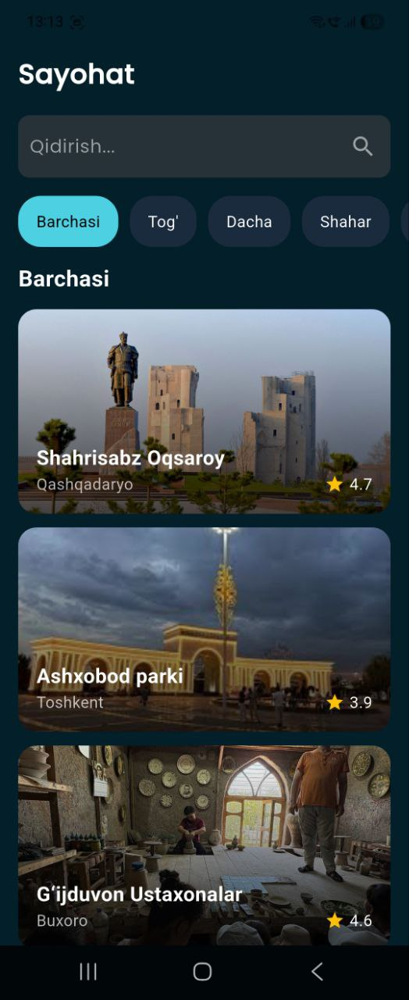
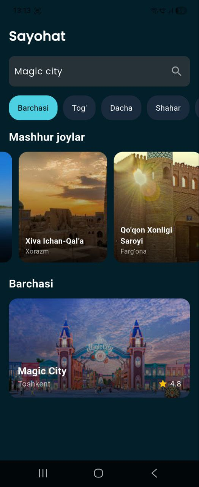
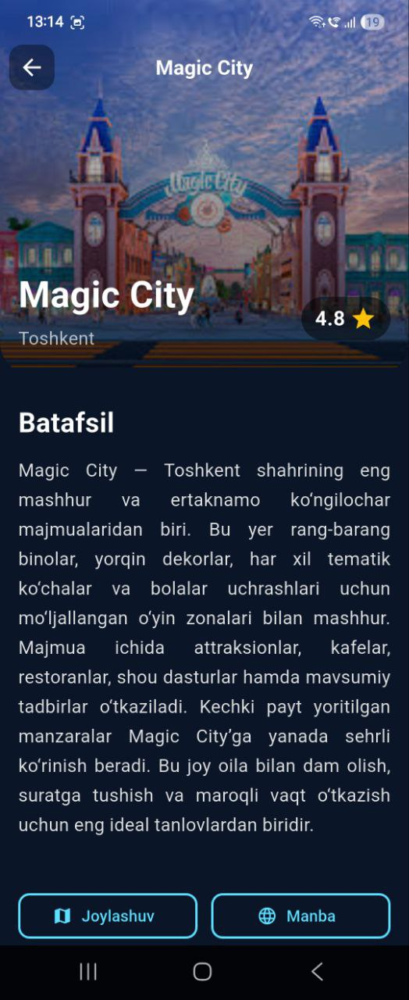

# Info-App

Welcome to the **Info App** repository! This Flutter-based application provides information about
popular travel destinations in Uzbekistan. The app showcases beautiful places, along with images and
details, across three main screens: Splash, Home, and Detail. The **Home Screen includes a search
feature** to quickly find destinations. The app is designed to provide a smooth and visually
appealing experience for users interested in exploring Uzbekistan.

📱 **App Overview**
**Info App** helps users discover travel destinations in Uzbekistan. Users can browse beautiful
places, see images, and view detailed information about each location. The app includes seamless
navigation across three main screens:

* **Splash Screen**: A welcoming and visually engaging introduction to the app.
* **Home Screen**: Browse a curated list of popular travel destinations with images. The screen also
  includes a **Search feature** for quickly finding destinations.
* **Detail Screen**: View detailed information about each destination, including photos and
  descriptions.

🚀 **Features**

* **Beautiful UI**: Clean and modern user interface with smooth animations.
* **Search Functionality in Home Screen**: Quickly find destinations directly from the Home Screen.
* **High-Quality Images**: Browse destinations with high-resolution images.
* **Three Main Screens**: Splash, Home, and Detail screens, ensuring easy navigation and a
  user-friendly experience.

⚙️ **Technologies Used**

* **Flutter**: Framework to build natively compiled applications for mobile, web, and desktop from a
  single codebase.
* **Dart**: Programming language used for Flutter development.
* **Image Handling**: Display beautiful images of destinations with smooth loading.
* **Navigation**: Intuitive navigation between Splash, Home, and Detail screens.

